# Recommendations for steps after the first login

## Convenient use of end-to-end encryption (E2EE)

Matrix not only encrypts transports to and from the home server of envs.net but also allows the use of end-to-end encryption (E2EE). For this, cryptographic keys have to be exchanged between all devices that want to write end-to-end encrypted. This technical necessity sounds and is complicated, but in the meantime it has become very convenient for the users. The many cryptographic keys created by the client are stored on the respective device. If this is a tab in a browser, for example, there is a risk that this tab will be closed unintentionally. Then all encrypted contents are no longer readable. To prevent this from happening, a key protection is offered on the home server of the envs.net, on which (protected with a security phrase (or security key that can be calculated from it) all cryptographic keys are stored encrypted.

!!! danger
    It is highly recommended to use this key backup (with a secure security phrase which is NOT your envs.net password) and read on at [Other important settings](#other_important_settings)!

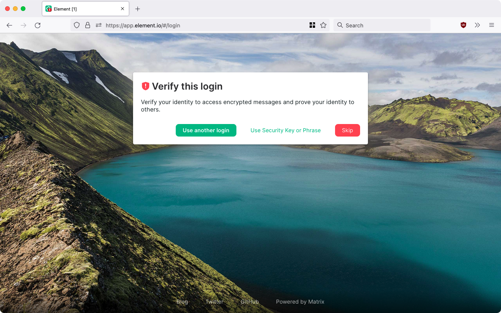

If you skip this now, the next screen would look like this:
   
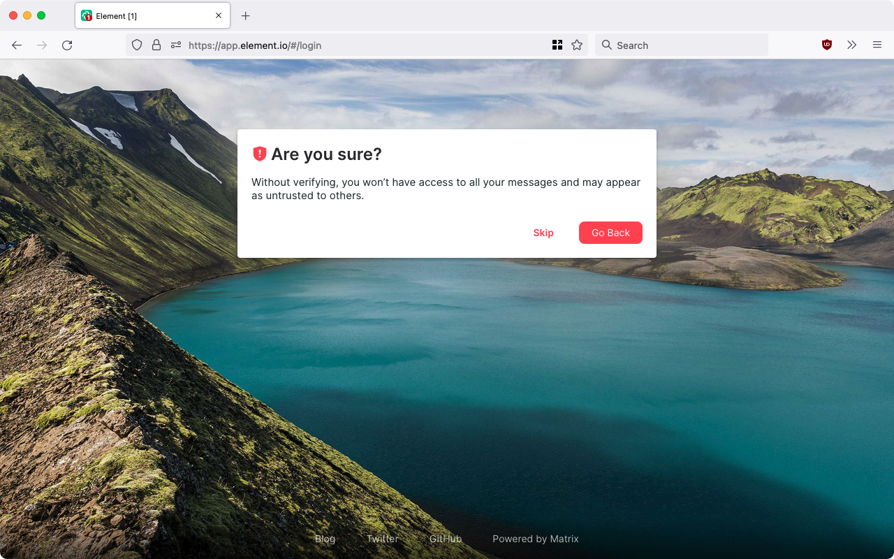

Key protection is highly recommended for worry-free end-to-end encryption. For this reason, a smaller tooltip will prompt you to set up the encryption even after you skip further:
   
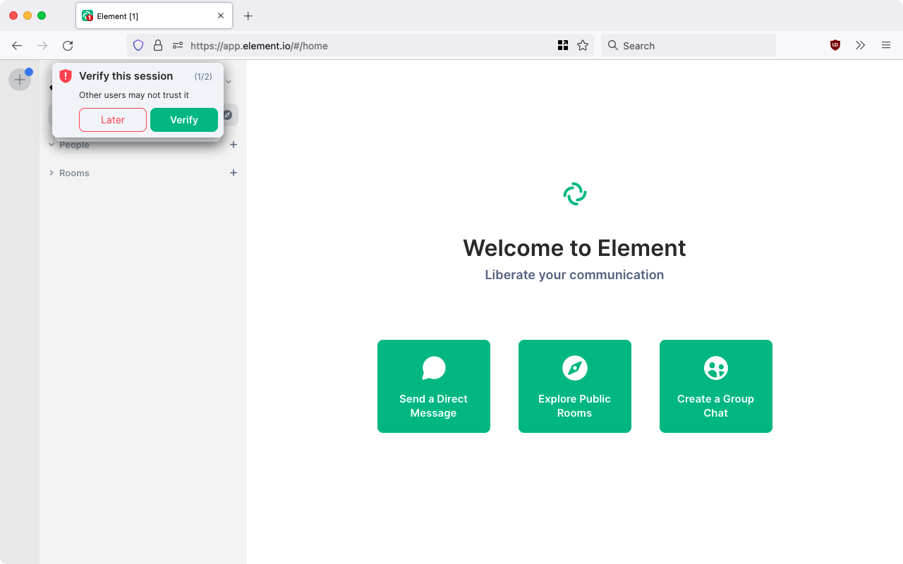

If you omit this here as well, you will get a last warning if you log off consciously. If no key backup is set up at the latest, encrypted calls that may have already taken place cannot be accessed later. If the tab is closed, this also corresponds to a logout.
   
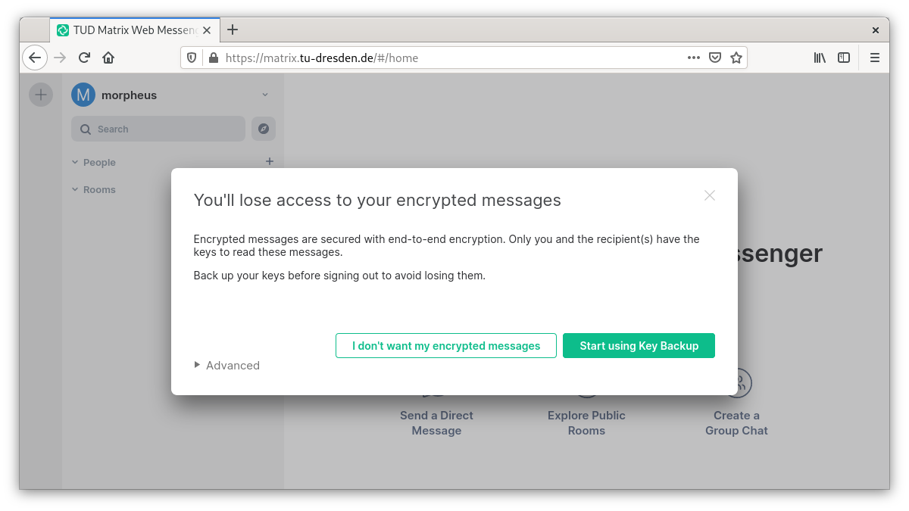

## Other important settings

After successfully setting up the key backup, you now activate the desktop notifications:
   
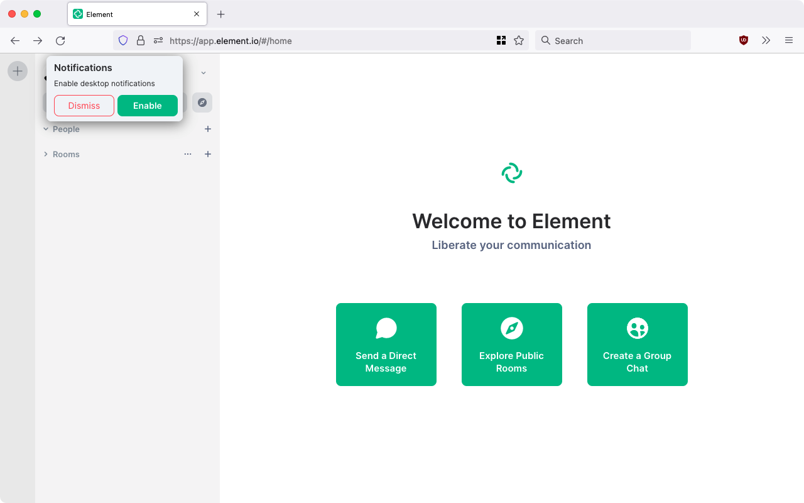

This can be undone later and especially individual "conversations" can be set in their notification authority

Adjust settings in the Settings menu: to do this, click on the line of the e-mail address and the downward pointing triangle and then on the line "All settings":

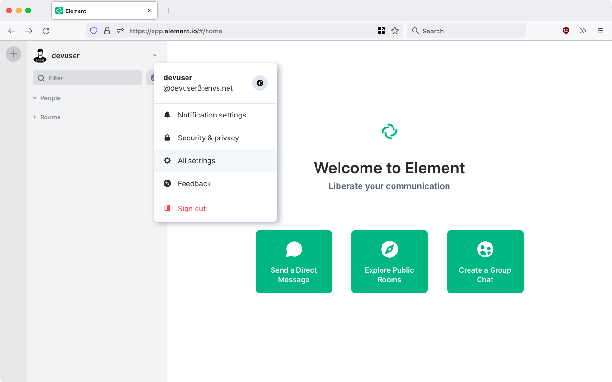

In the settings you can change your display name ("First Name Last Name") in the **General** tab if necessary and upload a profile picture (select profile picture <5MB):

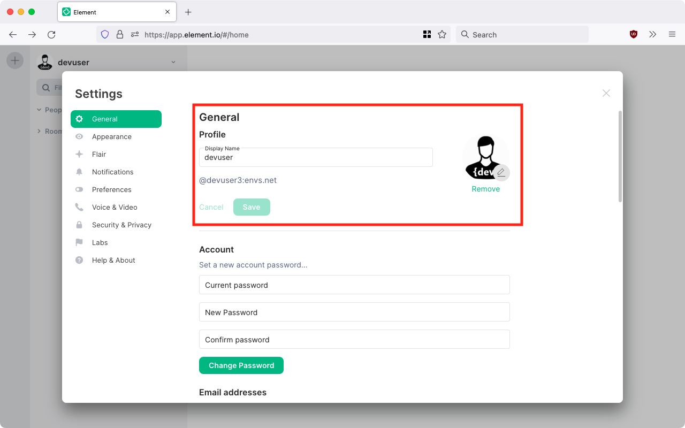

The e-mail address field is not necessarily to be filled in, since an e-mail address is stored via your envs.net login. Theoretically you can add more addresses here, e.g. to have notifications about missed messages sent to another e-mail address.

On the same page you can also change the design theme from light to dark.

In the **Notifications** tab you can activate e-mail notifications (to be informed about missed messages) as well as acoustic notifications and set them granularly for individual activities of others. For more information see the [notifications](/notifications/).

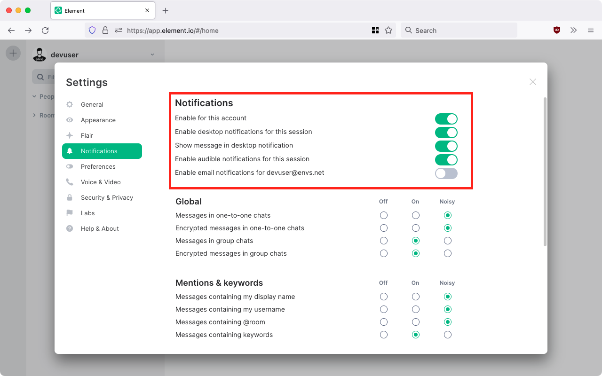

In the **Voice & Video** tab, you can authorize the Matrix client element to use your media (camera + microphone), allow direct voice/video calls via peer-to-peer connections, and in the case of video calls, to see yourself in a small picture:

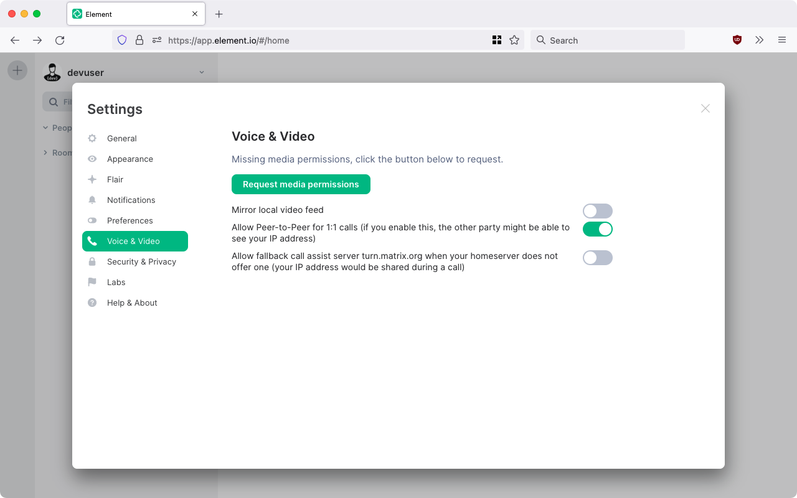

Fortunately, 1:1 calls start end-to-end encrypted by default. To really trust this encryption with a good feeling, users:inside can perform the key comparison with interlocutor:inside. To ensure that this also applies to all devices of these conversational partners, Matrix users must in turn verify the keys of all their devices with each other (technical term: cross-signing). If you follow the instructions below, this can be done very conveniently.

## Security & Privacy

In the **Security & Privacy** tab you will find all your devices that have been used by the Matrix account so far. 

* Remove any sessions that are no longer in use by marking the square box at the end of the line and clicking on the red button that appears.
  

* The device names also give you an overview when comparing keys between your devices. 

* The public names of your devices which can be assigned here (by clicking on them with the mouse) can also be viewed by your conversation partner:inside.  This helps if they want to compare the cryptographic keys of your devices (e.g. laptop + cell phone) and can easily identify the device names.

* The many cryptographic keys are stored on the respective device. If this is e.g. a tab in a browser, there is a risk that this tab will be closed unintentionally. Then all encrypted contents are no longer readable. To prevent this from happening, a key protection is offered on the home server of envs.net, on which (protected by a passphrase) all cryptographic keys are stored encrypted. It is strongly recommended to use this key backup!

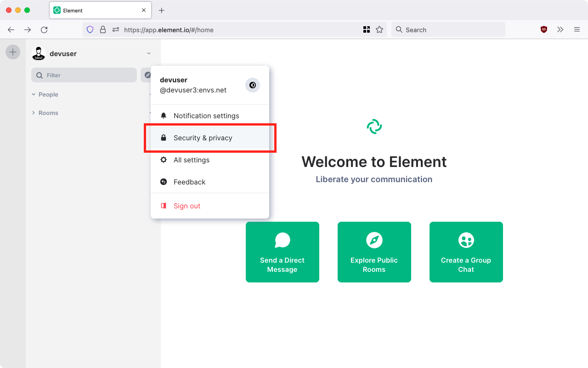

## Secure Backup

If not set up after initial registration: The **Secure Backup** is a valuable achievement, as it enables the keys of all end-to-end encrypted calls to be centrally secured on the envs.net server with a password. This allows convenient use of multiple devices or matrix clients. To do so, click on "Start using key backup" and choose a strong security phrase (but not the envs.net password). This security phrase will always have to be entered if keys are to be synchronized with the key backup.

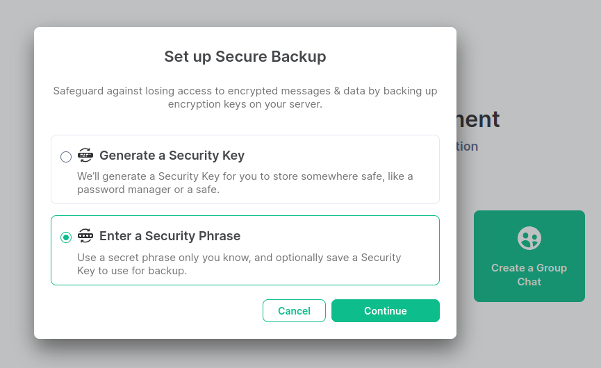

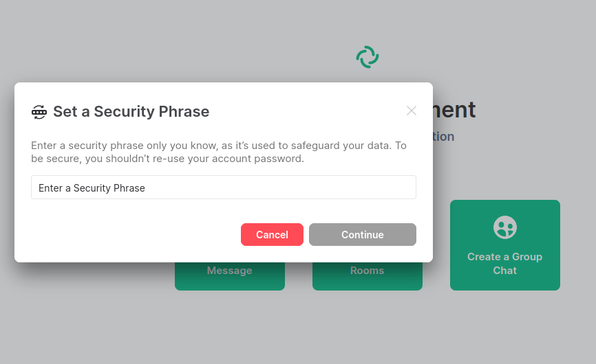

Alternatively, instead of the security phrase, you can also have a security key generated that serves the same purpose as the security phrase. Furthermore, the security key is generated in addition to the security phrase and should be kept safe and retrievable as an emergency key (e.g. save it as .txt file or print it out) 

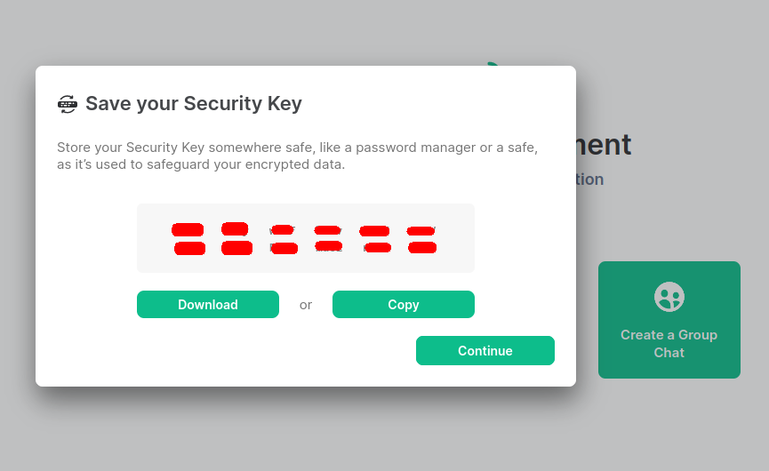 
